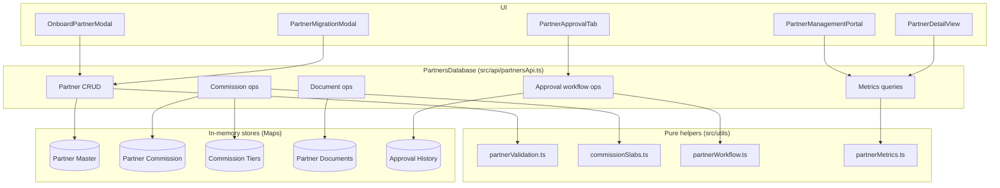
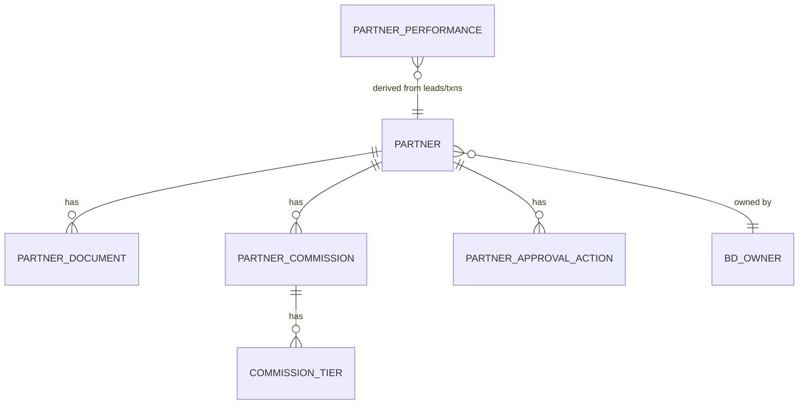

# Design Document

## Overview

This design restructures Partner Onboarding and Management into a normalized model that matches the Partner Management PRD. It replaces the current monolithic `Partner` type (which embeds commission and documents and uses a two-step Manager→Head approval) with four related entities — Partner Master, Partner Commission + Commission Tiers, Partner Documents — plus a derived Partner Performance layer.

The implementation follows the existing project conventions:
- **Data layer**: an in-memory `PartnersDatabase` class mirroring the `LeadsDatabase` pattern in `src/api/leadsApi.ts` (Map-backed stores, `generateId(prefix)`, `ApiResponse<T>` returns).
- **Pure business logic**: validation, slab resolution, workflow transitions, and metric calculations live in standalone, side-effect-free helper functions under `src/utils/` so they are unit-testable without React.
- **Types**: new partner types go in a dedicated `src/types/partner.ts` module, keeping `src/types.ts` focused and avoiding a sprawling edit. The legacy `Partner` type in `src/types.ts` is deprecated and replaced by references to the new model.
- **UI**: existing partner components (`OnboardPartnerModal`, `PartnerApprovalTab`, `PartnerManagementPortal`, `AgreementUploadModal`) are updated to consume the new model.

### Goals
- Normalize partner data per the PRD data relationship diagram.
- Support configurable, non-hardcoded commission slabs per product.
- Implement the single-Head approval workflow with Approve / Review Required / Reject.
- Generate Partner Code only on activation.
- Support bulk migration of existing partners bypassing approval.
- Calculate partner-level and BD-level metrics from system data.

### Non-goals
- No DocuSign/e-signature, OCR, lender integration, or LMS/Nexus split.
- No real database or file persistence (in-memory mock, consistent with the repo).

## Architecture



### Data relationship (per PRD §8)



## Components and Interfaces

### 1. Types (`src/types/partner.ts`)

```typescript
export type PartnerStatus =
  | 'Draft'
  | 'Pending Head Approval'
  | 'Review Required'
  | 'Rejected'
  | 'Active';

export type PartnerType = 'Education Consultant' | 'FX' | 'DSA' | 'Other';
export type PartnerScale = 'Single Branch' | 'Multi Branch';
export type AddressType = 'Head Office' | 'Branch';

export interface PartnerAddress {
  addressLine1: string;
  addressLine2?: string;
  city: string;
  state: string;
  pincode: string;
  country: string;
}

export interface PartnerMaster {
  // Identity
  id: string;                 // internal, P#####
  partnerCode?: string;       // commercial, generated on activation
  status: PartnerStatus;

  // Business legal
  legalBusinessName: string;
  partnerType: PartnerType;
  partnerScale: PartnerScale;
  panNumber: string;
  cin?: string;
  gstNumber?: string;

  // Owner
  ownerName: string;
  ownerEmail: string;
  ownerPhone: string;

  // Contact person
  contactPersonName: string;
  contactPersonEmail: string;
  contactPersonPhone: string;

  // Addresses
  registeredAddress: PartnerAddress;
  operatingSameAsRegistered: boolean;
  addressType: AddressType;
  operatingAddress?: PartnerAddress;   // required when operatingSameAsRegistered === false

  // Ownership
  bdOwnerId: string;          // active BD user id, e.g. U1001
  bdOwnerName?: string;

  // Timestamps
  createdAt: string;
  updatedAt: string;
}

export type TierMetric =
  | 'Sanctioned Loan Amount'
  | 'Number of SIMs'
  | 'Number of Accounts'
  | 'Number of Bookings'
  | 'Booking Value'
  | 'Transfer Volume';

export type CommissionType = 'Percentage' | 'Flat';

export interface CommissionTier {
  id: string;
  commissionId: string;       // FK -> PartnerCommission.id
  slabIndex: number;          // 0-based order
  fromValue: number;          // inclusive lower bound (absolute quantity)
  toValue: number | null;     // exclusive/inclusive upper bound; null = No Limit (last slab)
  commissionType: CommissionType;
  commissionValue: number;    // percent (e.g. 0.5 => 0.5%) or flat amount per unit
}

export interface PartnerCommission {
  id: string;
  partnerId: string;          // FK -> PartnerMaster.id
  product: string;            // MasterProduct
  tierMetric: TierMetric;
  commissionType: CommissionType; // default type for the config
  effectiveFrom: string;
  effectiveTo?: string;
  status: 'Active' | 'Inactive';
  tiers: CommissionTier[];    // denormalized convenience; source of truth = tier store
}

export type DocumentType = 'PAN' | 'GST' | 'CIN' | 'Agreement' | 'Other';
export type DocumentStatus = 'Pending' | 'Uploaded' | 'Approved' | 'Rejected';

export interface PartnerDocument {
  id: string;
  partnerId: string;
  documentType: DocumentType;
  fileName: string;
  fileUrl: string;
  status: DocumentStatus;
  uploadedBy: string;
  uploadedAt: string;
  reviewedBy?: string;
  reviewedAt?: string;
  rejectionReason?: string;
}

export type ApprovalAction =
  | 'submitted' | 'approved' | 'rejected' | 'review_required' | 'resubmitted' | 'migrated';

export interface PartnerApprovalAction {
  id: string;
  partnerId: string;
  timestamp: string;
  action: ApprovalAction;
  actor: string;
  actorRole: 'BD' | 'Head' | 'System';
  comment?: string;
}

export interface PartnerPerformance {
  partnerId: string;
  totalLeads: number;
  qualifiedLeads: number;
  activeLeads: number;
  convertedLeads: number;
  conversionRate: number;              // 0 when totalLeads === 0
  productWiseLeads: Record<string, number>;
  productWiseConversion: Record<string, number>;
  loanSanctionedAmount: number;
  loanDisbursedAmount: number;
  commissionEarned: number;
  commissionPaid: number;
  pendingCommission: number;           // earned - paid
}

export interface BdPartnerMetrics {
  bdOwnerId: string;
  partnersOnboarded: number;
  activePartners: number;
  activePartnerRate: number;           // 0 when onboarded === 0
  partnersGeneratingLeads: number;
  leadsGenerated: number;
  partnerLogins: number;
}
```

### 2. Pure helpers

**`src/utils/partnerValidation.ts`**
```typescript
export interface ValidationError { field: string; message: string; }
export function validatePartnerMaster(p: Partial<PartnerMaster>): ValidationError[];
export function isValidPan(pan: string): boolean;       // ^[A-Z]{5}[0-9]{4}[A-Z]$
export function isValidEmail(email: string): boolean;
export function isValidPhone(phone: string): boolean;   // digits, length 7-15
export function isValidPincode(pincode: string): boolean; // numeric
```
Validation enforces mandatory fields (Req 1.2), conditional operating address (Req 1.4), and enum/format constraints (Req 1.6–1.8, 1.11).

**`src/utils/commissionSlabs.ts`**
```typescript
// Validate slabs are contiguous, non-overlapping; last may be unbounded (Req 3.9)
export function validateSlabs(tiers: CommissionTier[]): ValidationError[];
// Resolve which slab a given metric value falls into
export function resolveSlab(tiers: CommissionTier[], value: number): CommissionTier | null;
// Compute commission for a value using the resolved slab (Req 7.4)
export function computeCommission(tiers: CommissionTier[], value: number, unitsOrAmount: number): number;
```

**`src/utils/partnerWorkflow.ts`**
```typescript
export type WorkflowDecision = 'approve' | 'review_required' | 'reject';
export interface TransitionResult { nextStatus: PartnerStatus; error?: string; }
// Pure state machine (Req 2, Req 5). Blocks approve if mandatory docs not Approved (Req 4.8/5.9).
export function nextStatusForDecision(
  current: PartnerStatus,
  decision: WorkflowDecision,
  mandatoryDocsApproved: boolean
): TransitionResult;
export function canSubmit(current: PartnerStatus): boolean;
export function canResubmit(current: PartnerStatus): boolean;
export function mandatoryDocsApproved(docs: PartnerDocument[]): boolean; // PAN + Agreement Approved
```

**`src/utils/partnerMetrics.ts`**
```typescript
export function calculatePartnerPerformance(partnerId: string, leads, txns, commissions): PartnerPerformance;
export function calculateBdPartnerMetrics(bdOwnerId: string, partners, leadsByPartner, logins): BdPartnerMetrics;
```
Both guard against divide-by-zero (Req 7.3, 8.2).

### 3. API (`src/api/partnersApi.ts`) — `PartnersDatabase`

Mirrors `LeadsDatabase`: private `Map` stores, `generateId(prefix)`, `generatePartnerId()` → `P#####`, `generatePartnerCode()` on activation. All methods return `ApiResponse<T>`.

| Method | Purpose | Requirements |
|---|---|---|
| `createPartner(input)` | Create Draft/Pending partner (validates master) | 1, 2.1–2.4 |
| `updatePartner(id, patch)` | Edit partner (allowed in Draft/Review Required) | 1, 5.7 |
| `submitPartner(id)` | Draft → Pending Head Approval | 2.4, 5.1 |
| `reviewPartner(id, decision, actor, comment)` | Head decision; sets status; generates code on approve | 5.3–5.9, 2.5 |
| `resubmitPartner(id)` | Review Required → Pending Head Approval | 5.7 |
| `setCommission(partnerId, config)` | Create/replace active commission for a product (validates slabs) | 3 |
| `getCommissions(partnerId)` | List commission configs + tiers | 3, 9 |
| `addDocument(partnerId, doc)` | Add document (status Uploaded) | 4.1–4.6 |
| `reviewDocument(docId, status, reviewer, reason?)` | Approve/Reject a document | 4.7 |
| `bulkCreatePartners(rows)` | Migrate existing partners → Active, build commissions, generate code | 6 |
| `getPartnerPerformance(id)` | Derived metrics | 7 |
| `getBdMetrics(bdOwnerId)` | BD metrics | 8 |
| `deleteCommission(id)` | Remove commission + cascade tiers | 9.3 |

Referential integrity (Req 9): commission/tier/document creation validates the Partner exists; deleting a commission cascades its tiers.

### 4. UI updates

- **`OnboardPartnerModal`**: fields updated to new Partner Master schema (Partner Scale, Address Type, Education Consultant/FX/DSA/Other, operating-same-as-registered conditional). Commission step becomes a per-product slab builder (add/remove slabs, metric + type per product). Submit creates partner as `Pending Head Approval`; no code shown yet.
- **`PartnerApprovalTab` / `PartnerManagementPortal`**: single Head review surface showing profile + commission + documents + agreement together, with Approve / Review Required / Reject actions. Status tabs updated to new statuses. Approve disabled until mandatory docs Approved.
- **`AgreementUploadModal`**: becomes a document upload that creates an `Agreement`-type `PartnerDocument` with review lifecycle (not a direct activation).
- **New `PartnerMigrationModal`** (lightweight): paste/import rows to bulk-create existing partners (CSV-shaped input → `bulkCreatePartners`).
- **`PartnerDetailView`**: reads commissions, documents, and performance from the new model.
- **`App.tsx`**: swap partner state/handlers to use `PartnersDatabase`.

## Data Models

Store layout inside `PartnersDatabase`:
- `partners: Map<string, PartnerMaster>`
- `commissions: Map<string, PartnerCommission>`
- `tiers: Map<string, CommissionTier>`
- `documents: Map<string, PartnerDocument>`
- `approvalHistory: Map<string, PartnerApprovalAction>`

Partner ID: `P` + zero-padded counter (`P00123`). Partner Code: generated on activation, e.g. `PC` + sequential (distinct from internal id). Both uniqueness-checked (Req 9.4).

## Correctness Properties

These properties will be validated via unit tests over the pure helpers. (Vitest is not installed in the repo; tests are written framework-agnostically so they can run under Vitest once added, and the logic is also validated by `tsc --noEmit`. If Vitest install is permitted during tasks, tests run directly.)

1. **Slab coverage & non-overlap**: For any valid commission config, slabs sorted by `fromValue` are contiguous and non-overlapping, and exactly zero or one slab is unbounded (the last). `validateSlabs` rejects any config violating this. (Req 3.9)
2. **Slab resolution totality**: For any metric value ≥ 0 and a valid slab set whose first slab starts at 0, `resolveSlab` returns exactly one slab (or null only if value is below the first `fromValue`). (Req 3.5, 7.4)
3. **Commission non-negativity**: `computeCommission` returns a value ≥ 0 for non-negative inputs. (Req 7.4)
4. **Workflow safety**: `nextStatusForDecision('Pending Head Approval', 'approve', false)` never returns `Active` (approval blocked without mandatory docs). Approve with docs approved always yields `Active`; reject always yields `Rejected`; review_required always yields `Review Required`. (Req 5.3–5.9)
5. **Code-on-activation invariant**: A partner has a non-empty `partnerCode` if and only if its status has reached `Active` (via approval or migration). Never set at submission. (Req 2.5)
6. **Divide-by-zero guards**: `conversionRate` is 0 when `totalLeads === 0`; `activePartnerRate` is 0 when `partnersOnboarded === 0`. (Req 7.3, 8.2)
7. **Referential integrity**: After `deleteCommission(id)`, no tier with `commissionId === id` remains. No commission/tier/document references a non-existent partner. (Req 9.3, 9.5)
8. **Validation completeness**: `validatePartnerMaster` returns an error for every missing mandatory field and for conditional operating-address fields when `operatingSameAsRegistered === false`. (Req 1.2, 1.4)

## Error Handling

- API methods return `ApiResponse<T>` with `success: false` and an error `{ code, message }` on validation failure or missing references (consistent with `LeadsDatabase`).
- Error codes: `VALIDATION_ERROR`, `NOT_FOUND`, `INVALID_TRANSITION`, `MANDATORY_DOCS_MISSING`, `SLAB_INVALID`, `DUPLICATE_CODE`.
- UI surfaces validation errors inline per field; workflow blocks (e.g. approve disabled) are reflected in button state with explanatory text.

## Testing Strategy

- **Unit tests** for all pure helpers (`partnerValidation`, `commissionSlabs`, `partnerWorkflow`, `partnerMetrics`) covering the correctness properties above, including boundary slab values and empty/zero inputs.
- **API tests** for `PartnersDatabase`: create → submit → review (all three outcomes) → activation + code generation; commission set/replace with cascade; document review gating activation; bulk migration bypassing workflow.
- **Type check**: `npm run lint` (`tsc --noEmit`) must pass with no errors as the baseline verification gate.
- Tests placed under `src/tests/` to match the existing structure (`properties/`, `unit/`). They are authored to run under Vitest; if Vitest is unavailable, `tsc --noEmit` plus a small runnable Node harness validates the logic.
