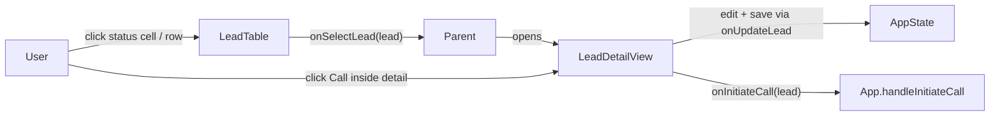

# Design Document

## Overview

This design captures the actual UI-only refactor that has shipped. Three status columns in `LeadTable` — Journey Stage, Calling Status, Lead Status — are now read-only badges. The `Actions_Column` no longer renders Call or Log buttons; it only renders the Claim button (when applicable) and the View arrow. All caller components have been trimmed of the no-op `handleUpdateLead` handlers and the dead prop pass-through for `onInitiateCall` / `onQuickLogOutcome` / `onUpdateLead`.

No data model changes. No API changes. No changes to `LeadDetailView`, `LeadDetailViewRefactored`, or their section components — they were already the canonical edit sites for these fields and continue to be.

## Architecture

### Current flow



Key architectural decisions:

- **Status cells reuse the row-click contract.** Clicking a `Status_Cell` calls `onSelectLead(lead)`, matching every other navigational cell (`id`, `studentName`, `nextCall`, `products`, `kpiStatus`).
- **`LeadTable` props kept for compatibility.** `onInitiateCall`, `onQuickLogOutcome`, and `onUpdateLead` remain in the props interface as optional but unused. Callers that still reference them (none, after this change) would compile without error. This is a defensive choice to avoid the caller cleanup being blocking on the initial ship.
- **All caller components cleaned up.** Every consumer of `LeadTable` had its no-op `handleUpdateLead` handler removed and stopped forwarding `onInitiateCall` / `onQuickLogOutcome`. Prop signatures shrank in `AllLeadsView`, `RmDashboard`, `TeamLeadDashboard`. `BdeDashboard` (which passed `() => {}` no-ops) stopped forwarding those props too. `App.tsx` removed the now-unreferenced `handleQuickLogOutcome`; `handleInitiateCall` is retained because `LeadDetailView` and `EducationLoanDetailView` still call it.

### Files touched

| File | Change |
| --- | --- |
| `src/components/LeadTable.tsx` | Removed `editingCell` state, `handleInlineEdit`, all three inline `<select>` dropdowns and chevrons. Actions column now renders only Claim (conditional) and View arrow. Deprecated props kept optional. Unused imports removed (`Phone`, `Clock`, `CheckCircle2`, `SlidersHorizontal`, `Plus`, `ChevronDown`, `JourneyStage`, `isLeadOverdue`). |
| `src/components/AllLeadsView.tsx` | Removed `handleUpdateLead`. Dropped `onInitiateCall` and `onQuickLogOutcome` from props and the `LeadTable` invocation. |
| `src/components/RmDashboard.tsx` | Removed `handleUpdateLead`. Dropped `onInitiateCall` and `onQuickLogOutcome` from props and from the `LeadTable` / `AllLeadsView` invocations. |
| `src/components/TeamLeadDashboard.tsx` | Removed `handleUpdateLead`. Dropped `onInitiateCall` and `onQuickLogOutcome` from props and the `LeadTable` invocation. |
| `src/components/BdeDashboard.tsx` | Removed `handleUpdateLead`. Dropped no-op `onInitiateCall` and `onQuickLogOutcome` pass-through to both `LeadTable` invocations. |
| `src/App.tsx` | Removed `handleQuickLogOutcome`. Stopped passing `onInitiateCall` / `onQuickLogOutcome` to `RmDashboard`, `TeamLeadDashboard`, and the leads-list `LeadTable`. Kept `handleInitiateCall` for `LeadDetailView` and `EducationLoanDetailView`. |

Files intentionally **not** touched: `LeadDetailView.tsx`, `LeadDetailViewRefactored.tsx`, `EducationLoanDetailView.tsx`, section components, API layer, types.

## Components and Interfaces

### `LeadTable` props (final)

```ts
interface LeadTableProps {
  leads?: StudentLead[];
  onSelectLead: (lead: StudentLead) => void;
  // Deprecated: kept as optional for backwards compatibility. Not used by the table.
  onInitiateCall?: (lead: StudentLead) => void;
  onQuickLogOutcome?: (lead: StudentLead) => void;
  onUpdateLead?: (lead: StudentLead) => void;
  kpiFilterLabel?: string;
  onClearKpiFilter?: () => void;
  enableColumnFilter?: boolean;
  mode?: 'lead' | 'partner';
  partners?: Partner[];
  onSelectPartner?: (partner: Partner) => void;
  selectedLeadIds?: string[];
  onLeadSelectionChange?: (selectedIds: string[]) => void;
  onBulkAssign?: (selectedIds: string[]) => void;
  showClaimButton?: boolean;
  onClaimLead?: (lead: StudentLead) => void;
}
```

The three deprecated props are only in the interface — they are not destructured in the component signature and no code path references them.

### Status cell rendering (all three)

Every status cell is a single-branch renderer with the same shape:

- `<td>` receives `className="py-3 px-4 cursor-pointer"` and `onClick={() => onSelectLead(lead)}`.
- Inside, a single badge `<div>` displays the value with its color mapping (Calling Status: emerald/amber/rose/slate + status dot; Lead Status: emerald/rose/slate; Journey Stage: slate). No chevron, no `<select>`, no `cursor-pointer` or `hover:*` classes on the badge itself.

### Actions column (final)

```tsx
<td className="py-3 px-4 text-right" onClick={(e) => e.stopPropagation()}>
  <div className="flex items-center justify-end gap-1.5">
    {showClaimButton && onClaimLead && (
      <button id={`btn-claim-${lead.id}`} onClick={() => onClaimLead(lead)} ...>
        <Check /> Claim
      </button>
    )}
    <button id={`btn-view-${lead.id}`} onClick={() => onSelectLead(lead)} ...>
      <ChevronRight />
    </button>
  </div>
</td>
```

When `showClaimButton` is false (RM Dashboard, TeamLead Dashboard, All Leads Management), the column shows only the View arrow. When true (AllLeadsView's claim queue), it shows Claim + View arrow.

### `AllLeadsView` props (final)

```ts
interface AllLeadsViewProps {
  leads: StudentLead[];
  onSelectLead: (lead: StudentLead) => void;
}
```

### `RmDashboard` props (final, relevant subset)

Dropped: `onInitiateCall`, `onQuickLogOutcome`. Retained: `leads`, `onSelectLead`, `onOpenNewLead`, `onOpenBulkUpload`, `onViewAllLeads`, `onStartDiscovery?`, `onSimulateInboundLead?`.

### `TeamLeadDashboard` props (final, relevant subset)

Dropped: `onInitiateCall`, `onQuickLogOutcome`. Retained: `leads`, `teamMembers?`, `onSelectLead`, `onBulkAssignLeads?`, `onViewTeamManagement?`, `onViewPartnerManagement?`, `onViewLeadManagement?`.

### `App.tsx` handlers (final)

- `handleInitiateCall` — retained, used by `LeadDetailView` and `EducationLoanDetailView`.
- `handleQuickLogOutcome` — removed. No remaining consumers.
- `handleUpdateLead` in `App.tsx` — retained. It's the real state-mutating handler used by `LeadDetailViewRefactored` (not to be confused with the no-op stubs that lived inside dashboard components).

## Data Models

No changes.

## Correctness Properties

*A property is a characteristic or behavior that should hold true across all valid executions of a system.*

Property tests were not authored as part of this ship, but the following properties describe the intended contract and can be added as PBTs when the Vitest suite lands.

### Property 1: Status cells are read-only badges

For any `leads: StudentLead[]` rendered by `LeadTable` in lead mode, for each row and each field `f ∈ {journeyStage, callingStatus, leadStatus}`, the `<td>` for `f`:

1. contains no `<select>`, `<option>`, or any interactive form control,
2. contains no `ChevronDown` SVG,
3. displays exactly one badge whose text equals `String(lead[f])`.

**Validates:** Requirements 1.1, 1.2, 2.1.

### Property 2: Clicking a navigational cell triggers `onSelectLead` for that row

For any `leads`, for each row × each columnKey ∈ `{id, studentName, priority, nextCall, products, kpiStatus, journeyStage, callingStatus, leadStatus}` or the View arrow button, clicking the element causes `onSelectLead` to be called exactly once with that row's `StudentLead`.

**Validates:** Requirements 1.3, 3.4, 3.5.

### Property 3: The Actions column contains no Call or Log button

For any `leads`, no rendered row contains an element with id `btn-call-${lead.id}` or `btn-quick-log-${lead.id}`.

**Validates:** Requirements 3.1, 3.2.

### Property 4: Claim button appears iff `showClaimButton` and `onClaimLead` are both provided

For any `leads`, the presence of `btn-claim-${lead.id}` per row is equivalent to `showClaimButton === true && typeof onClaimLead === 'function'`. Clicking it invokes `onClaimLead(lead)` exactly once.

**Validates:** Requirement 3.3.

### Property 5: Column filters restrict rendered rows

For any `leads` and any field `f ∈ {journeyStage, callingStatus, leadStatus}` and any allowed value `v`, setting `columnFilters[f] = v` renders exactly the row set `{ lead ∈ leads | lead[f] === v }`.

**Validates:** Requirement 2.4.

## Error Handling

- Any caller that still passes `onInitiateCall` / `onQuickLogOutcome` / `onUpdateLead` compiles cleanly because those props remain optional on `LeadTable`. Behavior net: the props are received and ignored.
- No previously mutating behavior is lost. Every removed handler in caller components (`handleUpdateLead` in dashboards, `handleQuickLogOutcome` in `App.tsx`) was either a `console.log` no-op (dashboards) or reachable only through the removed inline UI (`App.handleQuickLogOutcome`).
- The Call flow still exists inside `LeadDetailView` and `EducationLoanDetailView`, both of which continue to invoke `App.handleInitiateCall`.

## Testing Strategy

- **Manual verification (done):** Diagnostics via the language server are clean on `LeadTable.tsx`, `AllLeadsView.tsx`, `RmDashboard.tsx`, `TeamLeadDashboard.tsx`, `BdeDashboard.tsx`, and `App.tsx`. The dev server renders the table with read-only badges and no Call/Log buttons.
- **Automated PBTs (future work):** Once Vitest and `fast-check` are installed (per project context), the five properties above should each be implemented as a single property-based test tagged `// Feature: remove-inline-status-dropdowns, Property {N}` with a minimum of 100 iterations, generating `StudentLead[]` via a fast-check arbitrary.
- **Build validation (future work):** `tsc --noEmit` and the project's lint step should be added as a CI step once available; the current change already passes local IDE diagnostics.
